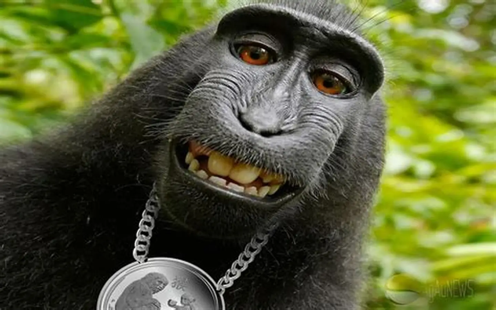

# 👋 Привет! Я Вадим

Добро пожаловать в моё портфолио! Здесь я делюсь своими проектами и рассказываю о том, чем увлекаюсь.

---

## 🧑‍💻 Обо мне

Я начинающий **Fullstack-разработчик**, который стремится создавать красивые, удобные и функциональные веб-приложения.  
Постоянно учусь новому, слежу за современными тенденциями в IT и совершенствую свои навыки.

---

## 🛠️ Мои навыки

| Категория | Технологии |
|-----------|-----------|
| **Языки программирования** | Python, Markdown (в процессе: JavaScript, TypeScript) |
| **Фреймворки** | React, Node.js (изучаю) |
| **Инструменты** | Git, VS Code, GitHub Pages, GitVerse, GigaIDE |

---

## 📫 Контактная информация

- 📧 **Email:** [kvasy@mail.ru](mailto:kvasy@mail.ru)
- 🐙 **GitHub:** [github.com/VadKarM](https://github.com/VadKarM)

---

## 📸 Моё фото

---

## 🌟 Интересные факты обо мне

1. Начал программировать в **2025 году**  
2. Люблю решать **сложные задачи** и находить нестандартные подходы  
3. Участвую в **open-source проектах** — вношу вклад в развитие сообщества  

---

## 📁 Мои проекты

| Название | Описание | Технологии |
|----------|----------|------------|
| **Проект «Тест 1»** | Тестирование работы с Git и основами Markdown | Git, Markdown |
| **Проект «Тест 2»** | Углублённое тестирование Git и знакомство с GitHub Pages | Git, Markdown, GitHub Pages |

---

## 💭 Мотивация

> *«Программирование — это не просто написание кода, это создание решений, которые делают мир лучше.»*

---

✨ *Этот сайт создан с помощью **GitHub Pages** и немного души.*
